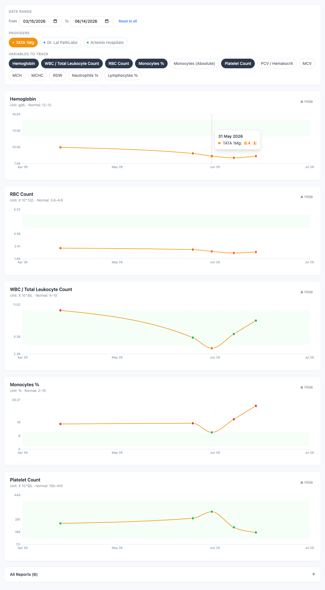

# Health Tracker

A personal blood report tracking dashboard for monitoring lab results over time across multiple providers.

Built for tracking **Renu Aggarwal's** blood reports from Dr. Lal PathLabs, Artemis Hospitals, TATA 1Mg, and any other lab — keeping each provider's data separate so results are never co-mingled.



## Features

- **Multi-provider tracking** — separate colored lines per lab, never mixed
- **Time-series charts** per variable with reference range bands
- **Abnormal values** highlighted in red (H) or orange (L)
- **Date range filter** — zoom into any time window
- **Collapse individual charts** for clean screenshots
- **PDF ingestion** — drop lab PDFs into a folder, run one command, charts update automatically (powered by Claude AI)
- **Add new variables** to track via a simple terminal prompt
- **All health data stays local** — never committed to GitHub

## Tech Stack

- **Frontend**: React + Vite + Tailwind CSS + Recharts
- **Backend**: Express.js (local file server)
- **Storage**: Local `data/reports.json` (git-ignored)
- **PDF parsing**: Anthropic Claude API

---

## Getting Started

### Prerequisites

- Node.js 18+
- An [Anthropic API key](https://console.anthropic.com) (only needed for PDF ingestion)

### Installation

```bash
git clone https://github.com/ruchiaggarwal82/health-tracker
cd health-tracker
git checkout claude/adoring-archimedes-q16c86
npm run install:all
```

### Configuration

Create a `.env` file in the project root (this file is git-ignored):

```bash
echo 'ANTHROPIC_API_KEY=sk-ant-your-key-here' > .env
```

### Run the app

```bash
npm run dev
```

Open **http://localhost:5173** in your browser.

---

## Adding Reports

### Option 1: PDF ingestion (recommended)

1. Drop PDF lab reports into the `pdfs/` folder
2. Run:
   ```bash
   npm run ingest
   ```
3. Claude reads each PDF, extracts all values, and updates `data/reports.json`
4. Refresh your browser — charts update immediately

The script:
- Skips PDFs it has already processed (tracked in `data/processed.json`)
- Detects and skips duplicate reports (same date + provider + lab number)
- Works with any lab format — Dr. Lal PathLabs, TATA 1Mg, Artemis, and others

### Option 2: Manual entry

Click **+ Add Report** in the top-right corner of the dashboard and fill in the form.

---

## Tracked Variables

| Key | Label | Unit |
|-----|-------|------|
| `hemoglobin` | Hemoglobin | g/dL |
| `tlc` | WBC / Total Leukocyte Count | thou/mm3 |
| `rbc` | RBC Count | mill/mm3 |
| `monocytes_pct` | Monocytes % | % |
| `monocytes_abs` | Monocytes (Absolute) | thou/mm3 |
| `platelets` | Platelet Count | thou/mm3 |
| `pcv` | PCV / Hematocrit | % |
| `mcv` | MCV | fL |
| `mch` | MCH | pg |
| `mchc` | MCHC | g/dL |
| `rdw` | RDW | % |
| `neutrophils_pct` | Neutrophils % | % |
| `lymphocytes_pct` | Lymphocytes % | % |

### Adding a new variable to track

```bash
npm run add-variable
```

Follow the prompts to enter the variable key, display name, unit, and reference range. It will appear in the dashboard immediately.

---

## Data & Privacy

| Path | Description | In Git? |
|------|-------------|---------|
| `data/reports.json` | All report data | No (git-ignored) |
| `data/processed.json` | List of ingested PDFs | No |
| `data/custom-variables.json` | Custom variable definitions | No |
| `pdfs/` | Source PDF files | No |
| `.env` | API key | No |

**Nothing in the `data/` or `pdfs/` folders is ever committed.** Back these up separately (e.g. keep them in iCloud/Google Drive).

---

## Project Structure

```
health-tracker/
├── client/               # React frontend (Vite)
│   └── src/
│       ├── App.jsx
│       ├── components/
│       │   ├── VariableChart.jsx
│       │   ├── AddReportModal.jsx
│       │   └── ReportsList.jsx
│       └── utils/
│           └── dataHelpers.js
├── server/               # Express backend
│   ├── index.js          # API server (port 3001)
│   ├── ingest.js         # PDF ingestion script
│   └── add-variable.js   # Add new variable script
├── data/                 # git-ignored, local only
│   ├── reports.json
│   ├── processed.json
│   └── custom-variables.json
├── pdfs/                 # git-ignored, drop PDFs here
└── .env                  # git-ignored, API key
```

## Available Scripts

| Command | Description |
|---------|-------------|
| `npm run dev` | Start both frontend and backend |
| `npm run install:all` | Install all dependencies |
| `npm run ingest` | Process new PDFs from `pdfs/` folder |
| `npm run add-variable` | Add a new variable to track |
| `npm run build` | Build frontend for production |
